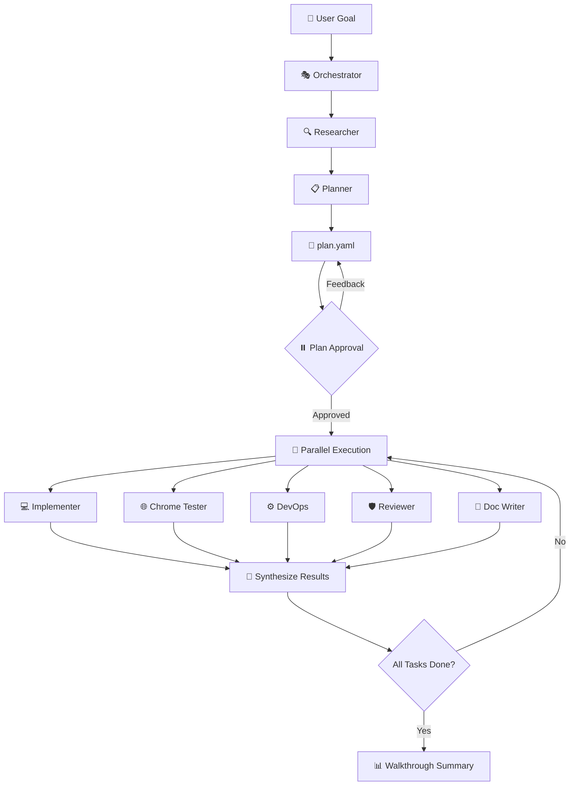

<p align="center">
  
  
  
  
</p>

# 💎 Gem Team: Multi-Agent Orchestration Framework

> **Transform complex projects into coordinated, verified, production-ready deliverables** — with intelligent agents that research, plan, implement, test, and document autonomously.

A modular, high-performance multi-agent team designed for complex project execution, feature implementation, and automated verification.

---

## ⚡ Why Gem Team?

### The Problem with Single-Agent AI

Traditional AI coding assistants hit walls when projects get complex:

- **Context overload** — One agent trying to hold everything leads to mistakes
- **No specialization** — Jack of all trades, master of none
- **Sequential bottlenecks** — Tasks execute one-by-one, wasting time
- **Missing verification** — Changes ship without proper testing
- **No audit trail** — What changed? Why? Who knows...

### The Gem Team Solution

| Challenge                     | Gem Team Approach                                                                                         |
| :---------------------------- | :-------------------------------------------------------------------------------------------------------- |
| 🧠 **Context Overload**       | Specialized agents with focused expertise — each holds only what it needs                                 |
| 🎯 **Lack of Specialization** | 8 expert agents: researcher, planner, implementer, tester, reviewer, devops, and documentation specialist |
| 🐢 **Sequential Bottlenecks** | DAG-based parallel execution — up to 4 agents work simultaneously                                         |
| ❌ **Missing Verification**   | Verification-first: no task completes without passing its verification command                            |
| 📜 **No Audit Trail**         | Persistent `plan.yaml` state file tracks every decision, status, and outcome                              |

### Key Benefits

- **🚀 10x Faster Execution** — Parallel agent execution eliminates bottlenecks
- **🎯 Higher Quality Output** — Specialized agents + mandatory verification = fewer bugs
- **🔒 Built-in Security** — Dedicated reviewer agent applies OWASP scanning on critical tasks
- **📊 Full Visibility** — Real-time plan status, clear approval gates, comprehensive summaries
- **🔄 Resilient Workflows** — Pre-mortem analysis, failure handling, and automatic replanning

---

## 🚀 Overview

Gem Team follows a **Strategic Planner/Dynamic Orchestrator** pattern. It decomposes high-level user goals into a **Directed Acyclic Graph (DAG)** of tasks, executes them in parallel across specialized agents, and maintains a rigorous state-controlled workflow.

```
┌─────────────────────────────────────────────────────────────────┐
│                         USER GOAL                               │
└──────────────────────────────┬──────────────────────────────────┘
                               ▼
┌──────────────────────────────────────────────────────────────────┐
│                      🎭 ORCHESTRATOR                             │
│  • Coordinates workflow    • Delegates via runSubagent          │
│  • Maintains plan.yaml     • Synthesizes results                │
└──────────────────────────────┬───────────────────────────────────┘
                               ▼
        ┌──────────────────────┴──────────────────────┐
        ▼                                             ▼
┌───────────────────┐                     ┌────────────────────────┐
│  🔍 RESEARCHER    │ ──────────────────▶ │    📋 PLANNER          │
│  Context Mapping  │     findings        │  DAG Task Decomposition│
└───────────────────┘                     └────────────┬───────────┘
                                                       ▼
                                          ┌────────────────────────┐
                                          │  📄 plan.yaml          │
                                          │  (Task DAG + State)    │
                                          └────────────┬───────────┘
                                                       ▼
        ┌────────────────────┬─────────────────────────┼─────────────────────────┬────────────────────┐
        ▼                    ▼                         ▼                         ▼                    ▼
┌──────────────┐    ┌──────────────┐         ┌──────────────┐         ┌──────────────┐      ┌──────────────┐
│ 💻 IMPLEMENTER│    │ 🌐 CHROME    │         │ ⚙️ DEVOPS    │         │ 🛡️ REVIEWER  │      │ 📝 DOC WRITER │
│ TDD Execution │    │ TESTER       │         │ CI/CD + Infra│         │ Security Gate│      │  Technical    │
└──────────────┘    └──────────────┘         └──────────────┘         └──────────────┘      └──────────────┘
```

---

## 🤖 Agent Roles

| Agent                      | Specialty      | Primary Responsibility                                                                        |
| :------------------------- | :------------- | :-------------------------------------------------------------------------------------------- |
| `gem-orchestrator`         | Coordination   | Coordinates multi-agent workflows, delegates tasks, synthesizes results via `runSubagent`     |
| `gem-researcher`           | Research       | Gathers codebase context, identifies relevant files/patterns, returns structured findings     |
| `gem-planner`              | Strategy       | Creates DAG-based plans with pre-mortem analysis, presents for approval, iterates on feedback |
| `gem-implementer`          | Execution      | Executes TDD code changes, ensures verification, maintains quality                            |
| `gem-chrome-tester`        | Testing        | Automates browser testing, UI/UX validation via Chrome DevTools                               |
| `gem-devops`               | Infrastructure | Manages containers, CI/CD pipelines, and infrastructure deployment                            |
| `gem-reviewer`             | Quality        | Security gatekeeper — OWASP scanning, secrets detection, compliance                           |
| `gem-documentation-writer` | Knowledge      | Generates technical docs, diagrams, maintains code-documentation parity                       |

---

## 🔄 Core Workflow



### Workflow Stages

1. **Inception** — Orchestrator receives goal → delegates to multiple Researchers (by focus area) → Planner synthesizes findings into a DAG
2. **Planning** — Planner synthesizes findings, creates 3-7 atomic tasks with dependencies, runs pre-mortem analysis, saves `plan.yaml`
3. **Plan Approval** — Planner presents plan via `plan_review` → **MANDATORY PAUSE** → iterates on feedback until approved
4. **Delegation** — Orchestrator identifies "ready" tasks (dependencies met) → launches up to 4 agents in parallel via `runSubagent`
5. **Execution** — Workers execute changes and run verification commands before returning results
6. **Synthesis** — Orchestrator processes handoffs, updates `plan.yaml`, routes failures for revision/retry
7. **Batch Confirmation** — Orchestrator presents summary via `walkthrough_review` → **MANDATORY PAUSE**
8. **Loop** — Repeat delegation/synthesis until all tasks complete. Triggers replanning if stuck.
9. **Delivery** — Final comprehensive `walkthrough_review` summary presented

---

## 🛠 Key Features

### 🔍 Focus-Based Context Gathering

The **Orchestrator** identifies key domains or features and launches multiple **Researcher agents** in parallel, each targeting a specific `focus_area`. This ensures deep, specific context is gathered for every part of the system before the **Planner** synthesizes it all into a unified `plan.yaml`.

### ⚡ Parallel Execution Engine

Up to **4 concurrent agents** execute independent tasks simultaneously, dramatically reducing total execution time while maintaining resource stability.

### 🧪 Verification-First (TDD)

No task completes without passing its defined `verification` command. Implementers follow strict **TDD discipline**:

- Write tests FIRST
- Confirm tests FAIL
- Write MINIMAL code to pass
- Check `get_errors` after every edit

### 🛡️ Security-First Review

The Reviewer agent acts as a **security gatekeeper** for critical tasks:

- OWASP Top 10 scanning
- Secrets/PII detection
- Compliance verification
- Tiered review depth (Full → Standard → Lightweight)

### 📊 Pre-Mortem Analysis

For complex plans, the Planner runs **pre-mortem analysis** — identifying potential failure modes, their likelihood, impact, and mitigation strategies BEFORE execution begins.

### 📝 Plan Continuity & Audit Trail

State persists in `docs/plan/{PLAN_ID}/plan.yaml`, providing:

- Recovery from interruptions
- Complex retry handling
- Clear audit trail of project evolution
- Full traceability of decisions

### 🔒 Agent Hierarchy

```
User → Orchestrator → Subagents (via runSubagent)
```

- **Orchestrator**: `disable-model-invocation: true` — delegates only, never executes
- **Subagents**: `disable-model-invocation: false` — execute tasks via tools
- **Isolation**: Subagents cannot call other subagents — all collaboration mediated by Orchestrator

---

## 📁 Project Structure

```
gem-team/
├── gem-orchestrator.agent.md      # Coordination hub
├── gem-researcher.agent.md        # Context gathering
├── gem-planner.agent.md           # DAG-based planning
├── gem-implementer.agent.md       # TDD code execution
├── gem-chrome-tester.agent.md     # Browser automation
├── gem-devops.agent.md            # Infrastructure & CI/CD
├── gem-reviewer.agent.md          # Security gatekeeper
├── gem-documentation-writer.agent.md  # Technical docs
├── docs/
│   └── plan/{PLAN_ID}/
│       ├── research_findings.md   # Research output
│       └── plan.yaml              # Task DAG state
└── README.md
```

---

## 🎯 Use Cases

| Scenario                         | How Gem Team Helps                                                              |
| :------------------------------- | :------------------------------------------------------------------------------ |
| **Large Feature Implementation** | Decomposes into parallel subtasks, implements with TDD, verifies each component |
| **Codebase Refactoring**         | Researches patterns, plans migration, executes incrementally with tests         |
| **Security Audit**               | Reviewer scans for OWASP issues, secrets, compliance gaps                       |
| **Documentation Overhaul**       | Doc Writer generates accurate docs maintaining code-documentation parity        |
| **CI/CD Pipeline Setup**         | DevOps agent creates containers, pipelines, deploys with health checks          |
| **UI/UX Testing**                | Chrome Tester automates validation matrix, captures visual evidence             |

---

## 📄 License

This project is licensed under the Apache License 2.0 — see the [LICENSE](LICENSE) file for details.

---

<p align="center">
  <b>Built for Gem Team — Precision. Parallelism. Progress.</b>
  <br/><br/>
  <i>Transform complexity into coordinated execution.</i>
</p>
